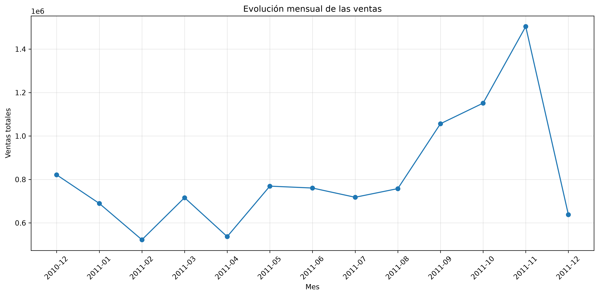
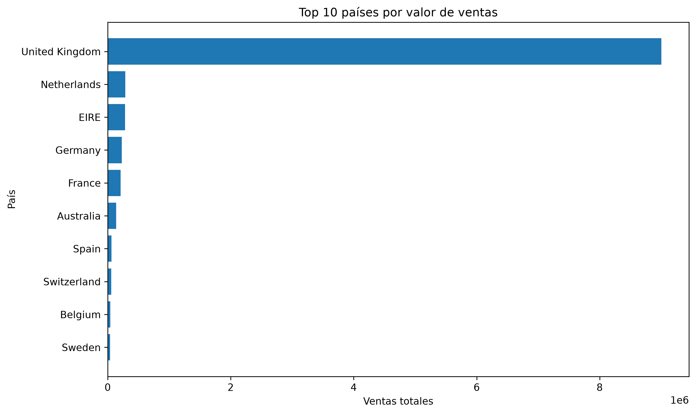
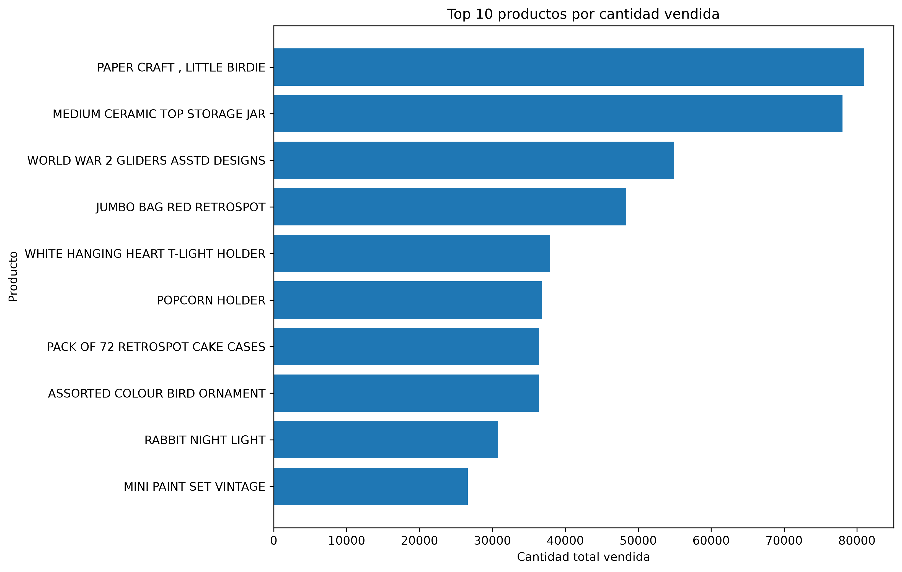

# Análisis del dataset Online Retail

## Descripción del proyecto

Este proyecto corresponde a un taller de la asignatura Fundamentos de Ciencia de Datos de la Maestría en Ciencia de Datos.

El objetivo es aplicar un flujo completo de trabajo con datos utilizando Python, Pandas, SQLite y Matplotlib.

El proceso realizado incluye:

- adquisición de datos;
- exploración inicial;
- limpieza de datos;
- almacenamiento en SQLite;
- lectura de datos desde SQLite hacia un DataFrame de Pandas;
- análisis exploratorio de datos (EDA);
- generación de metadatos;
- visualización de resultados.

## Fuente de datos

El dataset utilizado es **Online Retail**, disponible en el UCI Machine Learning Repository.

Fuente:

https://archive.ics.uci.edu/dataset/352/online+retail

El conjunto de datos contiene transacciones realizadas por una empresa minorista con sede en el Reino Unido.

## Estructura del dataset

El dataset original contiene 541909 registros y 8 variables.

Las variables originales son:

- `InvoiceNo`: número o código de factura.
- `StockCode`: código del producto.
- `Description`: descripción del producto.
- `Quantity`: cantidad de unidades registradas.
- `InvoiceDate`: fecha y hora de la transacción.
- `UnitPrice`: precio unitario del producto.
- `CustomerID`: identificador del cliente.
- `Country`: país asociado al cliente.

Durante el proceso de análisis se creó una variable adicional:

- `TotalAmount`: valor total de cada línea de venta, calculado como `Quantity * UnitPrice`.

## Parte 1: Adquisición y limpieza de datos

El archivo original fue leído utilizando Pandas:

    df = pd.read_excel("Online Retail.xlsx")

Antes de realizar la limpieza se analizaron:

- dimensiones del dataset;
- tipos de datos;
- valores nulos;
- registros duplicados;
- cantidades negativas o iguales a cero;
- precios negativos o iguales a cero;
- facturas canceladas.

### Problemas encontrados

Durante la exploración inicial se identificaron:

- 5268 registros duplicados;
- 1454 valores nulos en `Description`;
- 135080 valores nulos en `CustomerID`;
- 10624 registros con cantidades negativas o iguales a cero;
- 2517 registros con precios negativos o iguales a cero;
- 9288 registros asociados a facturas canceladas.

### Decisiones de limpieza

Se aplicaron las siguientes decisiones:

1. Se eliminaron registros duplicados exactos.
2. Se eliminaron facturas canceladas identificadas por valores de `InvoiceNo` que comienzan con la letra `C`.
3. Se conservaron únicamente registros con `Quantity > 0`.
4. Se conservaron únicamente registros con `UnitPrice > 0`.
5. Se eliminaron registros sin descripción del producto.
6. Se conservaron los valores faltantes de `CustomerID`, debido a que la ausencia del identificador del cliente no invalida necesariamente la información de la transacción.
7. Se creó la variable `TotalAmount`.

Después del proceso de limpieza se obtuvieron:

**524878 registros y 9 variables.**

## Almacenamiento en SQLite

Los datos limpios fueron almacenados en una base de datos SQLite.

La tabla creada se denomina:

`ventas_limpias`

El almacenamiento se realizó mediante Pandas y SQLite.

Posteriormente, la tabla fue leída nuevamente desde SQLite y transformada en un DataFrame de Pandas para realizar el análisis exploratorio.

## Parte 2: Análisis exploratorio de datos

Durante el EDA se analizaron:

- dimensiones del dataset;
- tipos de datos;
- estadísticas descriptivas;
- valores únicos;
- periodo temporal;
- países;
- productos;
- clientes identificados;
- ventas por país;
- cantidad vendida por producto;
- comportamiento de las ventas por mes.

Algunos resultados obtenidos fueron:

- 38 países;
- 3922 códigos de producto;
- 4015 descripciones de producto;
- 4338 clientes identificados;
- 19960 facturas diferentes.

Las estadísticas descriptivas muestran una alta dispersión en variables como `Quantity`, `UnitPrice` y `TotalAmount`, lo que evidencia la presencia de valores extremos.

## Parte 3: Visualización

Se generaron tres visualizaciones principales.

### 1. Evolución mensual de las ventas

La gráfica permite observar la evolución temporal de las ventas.

Durante 2011 se aprecia un incremento importante hacia los meses de septiembre, octubre y noviembre.

El comportamiento de diciembre debe interpretarse con precaución debido a que el periodo disponible puede no corresponder a un mes completo.

### 2. Top 10 países por valor de ventas

La visualización permite identificar los países que concentran el mayor valor de ventas.

El análisis evidencia una fuerte concentración de las transacciones en el mercado del Reino Unido.

### 3. Top 10 productos por cantidad vendida

Esta gráfica permite identificar los productos con mayor volumen de unidades vendidas.

Es importante diferenciar entre cantidad vendida y valor generado, ya que un producto con muchas unidades vendidas no necesariamente es el que produce mayores ingresos.

## Archivos del proyecto

- `online_retail_analisis.py`: lectura, diagnóstico, limpieza y almacenamiento en SQLite.
- `eda_online_retail.py`: análisis exploratorio de datos.
- `visualizaciones_online_retail.py`: generación de visualizaciones.
- `descripcion_dataset.txt`: descripción general del dataset.
- `metadatos.csv`: descripción de las variables.
- `grafico_1_ventas_mensuales.png`: evolución mensual de ventas.
- `grafico_2_ventas_por_pais.png`: principales países por valor de ventas.
- `grafico_3_productos_mas_vendidos.png`: productos con mayor cantidad vendida.
- `.gitignore`: archivos excluidos del repositorio.

## Tecnologías utilizadas

- Python
- Pandas
- SQLite
- Matplotlib
- OpenPyXL

## Ejecución del proyecto

Para reproducir el análisis:

1. Descargar el dataset Online Retail desde UCI.
2. Colocar el archivo `Online Retail.xlsx` en la misma carpeta del proyecto.
3. Ejecutar:

    python online_retail_analisis.py

4. Ejecutar:

    python eda_online_retail.py

5. Ejecutar:

    python visualizaciones_online_retail.py

## Conclusión

El proyecto permitió aplicar un flujo completo de ciencia de datos, desde la adquisición y limpieza de la información hasta su almacenamiento, análisis exploratorio y visualización.

El análisis permitió identificar patrones temporales, concentración geográfica de las ventas y productos con mayor volumen de unidades vendidas.

Además, el uso de SQLite permitió almacenar de forma persistente los datos limpios y reutilizarlos posteriormente para el análisis con Pandas.
